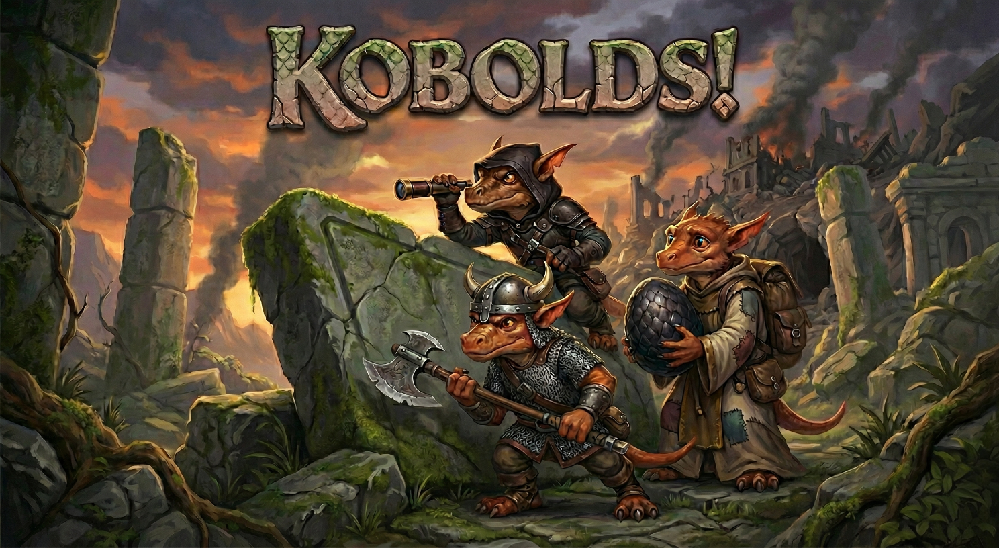

# kobolds!

## The Story

The Keep of the Great Dragon Kallinadorix once shook with her power. For generations your clan served her. You carved her tunnels, guarded her hoard, and lived under her protection: safe, warm, and unafraid.

Then the heroes came.

They breached the outer passages and advanced without hesitation. Kallinadorix met them in the central vault, but even her ancient strength could not stop them. Steel and spellwork filled the chambers. When the fighting ended, she was dead and her hoard was gone. Hundreds of kobolds lay with her, treated as vermin to be stamped out.

Now the keep is a tomb. The air tastes of ash. Stone is blackened and cracked. Bodies lie where they fell. Your clutchmates. Your family.

You are one of the few who survived.

In the deepest chamber, behind collapsed stone and scorched wards, you found her last egg. Uncracked. Unnoticed. Warm in your hands with a faint internal thrum. If the heroes had known of it, they would have taken it or destroyed it.

Now you choose. Hunt the heroes who destroyed your world. Guard the egg and rebuild from what remains. Or attempt something harder that honors both the dead and the unborn.

The keep is silent. The egg thrums in your hands.
